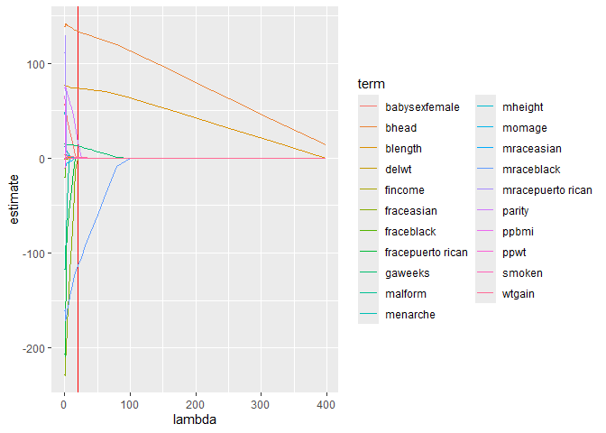
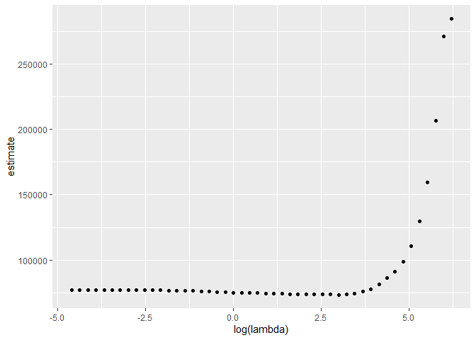

Statistical Learning
================

## Try Lasso

import and clean birth weight data

``` r
birthweight <- 
  read_csv("data/birthweight.csv") %>% 
  janitor::clean_names() %>% 
  mutate(
    babysex = 
        case_match(babysex,
            1 ~ "male",
            2 ~ "female"
        ),
    babysex = fct_infreq(babysex),
    frace = 
        case_match(frace,
            1 ~ "white",
            2 ~ "black", 
            3 ~ "asian", 
            4 ~ "puerto rican", 
            8 ~ "other"),
    frace = fct_infreq(frace),
    mrace = 
        case_match(mrace,
            1 ~ "white",
            2 ~ "black", 
            3 ~ "asian", 
            4 ~ "puerto rican",
            8 ~ "other"),
    mrace = fct_infreq(mrace)
    ) %>% 
  sample_n(200)
```

    ## Rows: 4342 Columns: 20
    ## ── Column specification ────────────────────────────────────────────────────────
    ## Delimiter: ","
    ## dbl (20): babysex, bhead, blength, bwt, delwt, fincome, frace, gaweeks, malf...
    ## 
    ## ℹ Use `spec()` to retrieve the full column specification for this data.
    ## ℹ Specify the column types or set `show_col_types = FALSE` to quiet this message.

Construct inputs for `glmnet`

``` r
x <- model.matrix(bwt ~., data = birthweight)[, -1]
y <- birthweight %>% pull(bwt)
```

Fit Lasso for Several Lambdas

``` r
lambda <- 10^seq(-2, 2.75, by = 0.1) 

lasso_fit <-
  glmnet(x = x, y = y, lambda = lambda)

lasso_cv <- 
  cv.glmnet(x = x, y = y, lambda = lambda)
lambda_opt <- lasso_cv[["lambda.min"]]
```

Usual Lasso Plot

``` r
lasso_fit %>% 
  broom::tidy() %>% 
  filter(term != "(Intercept)") %>% 
  select(term, lambda, estimate) %>% 
  complete(term, lambda, fill = list(estimate = 0)) %>% 
  ggplot(aes(x = lambda, y = estimate, group = term, color = term)) + 
  geom_vline(xintercept = lambda_opt, color = "red") +
  geom_line()
```

<!-- -->

``` r
final_lasso_fit <- 
  glmnet(x = x, y = y, lambda = lambda_opt)

final_lasso_fit %>% 
  broom::tidy()
```

    ## # A tibble: 8 × 5
    ##   term         step  estimate lambda dev.ratio
    ##   <chr>       <dbl>     <dbl>  <dbl>     <dbl>
    ## 1 (Intercept)     1 -5625.      20.0     0.759
    ## 2 bhead           1   134.      20.0     0.759
    ## 3 blength         1    73.8     20.0     0.759
    ## 4 delwt           1     0.392   20.0     0.759
    ## 5 gaweeks         1    12.9     20.0     0.759
    ## 6 mraceblack      1  -114.      20.0     0.759
    ## 7 parity          1    17.5     20.0     0.759
    ## 8 wtgain          1     0.967   20.0     0.759

Look at CV results.

``` r
lasso_cv %>% 
  broom::tidy() %>% 
  ggplot(aes(x = log(lambda), y = estimate)) + geom_point()
```

<!-- -->
